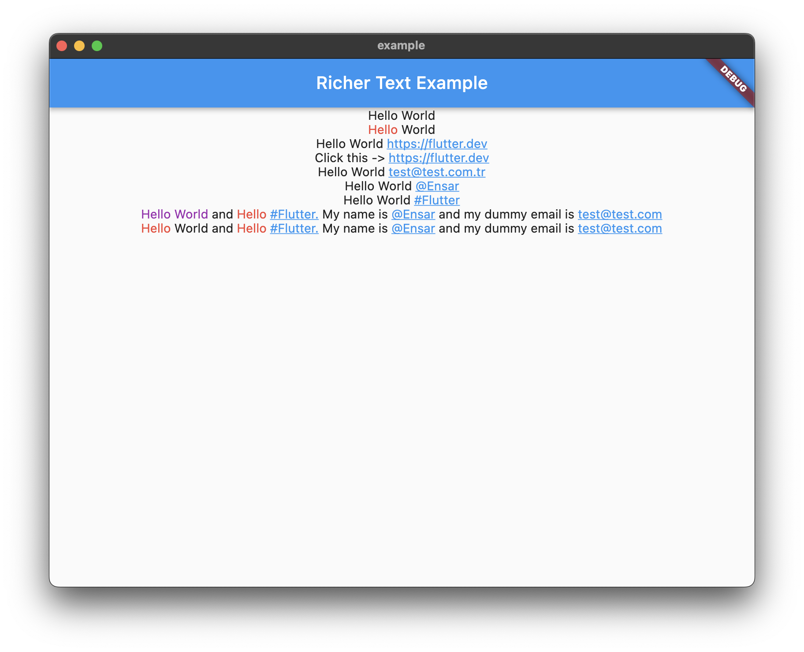

RicherText allows you to create Text widgets with multiple styles and colors within a single Text widget using RegExp.



## Features

-   Create Text widgets with multiple styles and colors within a single Text widget using RegExp.

## Getting started

-   Add the dependency to your pubspec.yaml

```yaml
dependencies:
    richer_text: ^0.0.1
```

-   Import the package

```dart
import 'package:richer_text/richer_text.dart';
```

And you are ready to go!

## Usage

There is a demo app in the example folder.

Basically, you need to create a RicherText widget and pass a list of RicherTextCatcher to it. Each RicherTextCatcher has pattern, builder and priority. The priority is used to determine which catcher should be used when multiple catchers collide on the same span of text. Highest priority value is 0. If two catchers have the same priority, the first one on the list will be used.


- Basic usage

```dart
RicherText(
    text: 'Hello World',
    catchers: [
        RicherTextCatcher(
        name: 'catch_test',
        pattern: RegExp(r'Hello'),
        builder: (text) => TextSpan(
            text: text, style: const TextStyle(color: Colors.red)),
        ),
    ],
),

```

- RicherTextCatchers

There are some predefined catchers in the RicherTextCatchers class. You can use them directly. Also, you can add recognizer to the TextSpan to make it clickable or to make it do anything you want. (Useful for URLs, emails, phone numbers, etc.)

```dart
RicherText(
text: 'Click this -> https://flutter.dev',
catchers: [
    RicherTextCatchers.urlCatcher(
        builder: (text) => TextSpan(
            text: text,
            style: const TextStyle(
                color: Colors.blue,
                decoration: TextDecoration.underline),
            recognizer: TapGestureRecognizer()
                ..onTap = () => ScaffoldMessenger.of(context)
                    .showSnackBar(
                        SnackBar(content: Text('You tapped $text'))),
            ))
    ],
),

```

## Additional information

-   [RicherText on pub.dev](https://pub.dev/packages/richer_text)
-   [RicherText on GitHub](https://github.com/AlfaSquaD/richer_text)

